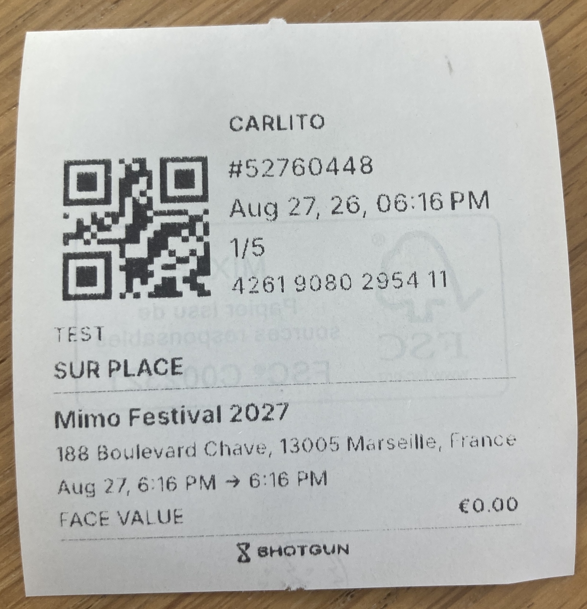
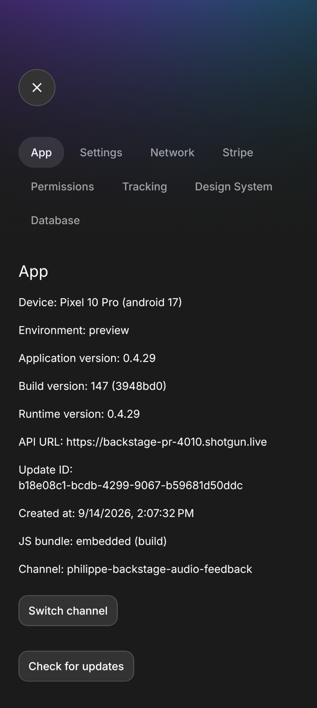

# Surviving D-Day

## Offline-first ground operations in React Native

<div class="pt-12">
    Antoine Rousseau — Engineering Manager @ Shotgun
</div>

<!--
Speaker Notes:
- ReactCon Berlin. 30 minutes, then 10 for questions.
- Shotgun Backstage is the app organizers use on D-Day: scan tickets at the door, sell on site, see live event data.
- Constraint: a 5-second freeze at the gate spills the queue onto the street. Internet is optional.
- Today we follow one scan through the architecture — not a tour of the npm list.
-->

---
layout: two-cols-header
---

# The door cannot stop

::left::

### D-Day

- Basements, fields, packed clubs
- Cellular dies when 10k people arrive
- Staff are stressed and not looking at docs
- A freeze at the gate is a street problem

::right::

### What the architecture must do

- Scan in well under a second, offline
- Keep selling on a normal phone
- Sync nearby devices without a server
- Never crash

<!--
Speaker Notes:
- Paint the room: dark, loud, drunk attendees, bouncers with gloves.
- We do not optimize for pretty dashboards. We optimize for "is this person allowed in, right now."
-->

---

# You're in

<div class="grid grid-cols-[1fr_16rem] gap-8 items-center h-[calc(100%-3.25rem)]">

<div>

Press-and-hold → QR → result overlay

<div class="flex gap-2 pt-6">
  <Badge variant="positive">Valid</Badge>
  <Badge variant="warning">Already in</Badge>
  <Badge variant="negative">Invalid</Badge>
</div>

</div>

<div class="h-full aspect-[9/16] justify-self-end rounded-[var(--decibel-radius-lg)] border border-dashed border-[var(--decibel-border-secondary)] bg-[var(--decibel-surface-secondary)] flex items-center justify-center text-center px-3 text-[var(--decibel-content-tertiary)] text-sm leading-relaxed">

Video placeholder<br>
`public/scan-demo.mp4`

<!--
<SlidevVideo autoplay muted loop autoreset="slide" class="h-full w-full object-cover rounded-[var(--decibel-radius-lg)]">
  <source src="/scan-demo.mp4" type="video/mp4" />
</SlidevVideo>
-->

</div>

</div>

<!--
Speaker Notes:
- Play the recording (or live demo if the device is ready). 60–90 seconds max.
- Ask them to watch three things: you hold to open the camera (not always-on), the result is full-screen, there is no spinner waiting on the network.
- Then: "that overlay did not wait for our API."
- Tap to Pay has its own demo later — don't play it here.
-->

---

# The rule

**A scan never waits on the network.**

SQLite is the source of truth at the door.

The server is how we catch up — later.

<!--
Speaker Notes:
- This is the whole talk in one sentence.
- TanStack Query is the reactive layer on top of SQLite, not the cache of a REST call we make at scan time.
- If the ticket is not in the local DB yet, we say still_loading. We do not guess.
-->

---

# Shape of the system

Expo app, oRPC server, shared SQLite schema — one TypeScript repo.

```
shotgun/
├── apps/backstage/          # Expo / React Native
├── apps/backstage-server/   # oRPC API (Next.js)
└── packages/backstage/      # Zod, Drizzle, scan types
```

<v-clicks>

- Phone: Expo, `expo-router`, Uniwind, `expo-sqlite`
- Wire: oRPC + Zod, typed as `APIClient` from the server
- UUIDs created offline using ATProto's TIDs

</v-clicks>

<!--
Speaker Notes:
- This sits inside a larger Shotgun monorepo. For Backstage, these three packages are the contract.
- Schema changes in packages/backstage break the app and the server at compile time.
- Skip the library laundry list. They will see the pieces as we walk the scan.
-->

---

# One QR, end to end

<v-clicks>

1. **Press-and-hold** opens the camera — not always-on (battery, accidents)
2. **SQLite JOIN** loads the ticket, deals, scan logs, transfers
3. **`decideScan()`** returns one of 12 outcomes
4. **Transaction** writes `syncActions` + `scanLogs`
5. **Overlay** immediately — staff already moved on
6. **BLE mesh** broadcasts the scan log to nearby phones
7. **Push** to the server every 5s, if we have a network

</v-clicks>

<!--
Speaker Notes:
- Spend time here. This is the architecture.
- Serial mutation scope { id: "scan" } so two rapid QR reads do not interleave.
- Mesh and server push are asynchronous. The bouncer does not wait.
- Next slides zoom into 1 (camera battery), 3, 4, 6, and 7.
-->

---

# The camera is three costs

Press-and-hold is the first cut. Battery is the rest.

<v-clicks>

1. **Native session** — just opening the camera
2. **Frame processor** — QR + barcode on every frame
3. **The library** — `expo-camera` is fine so far; we'll measure others if it isn't

</v-clicks>

<!--
Speaker Notes:
- Always-on camera was the obvious killer. Press-and-hold also prevents accidental scans with gloves / in a pocket.
- Even while held open, cost splits three ways: the hardware session, the JS/native frame pipeline looking for codes, and whichever camera library wraps it.
- expo-camera is the current pick because it behaves. If traces say it isn't battery-savvy enough, we measure alternatives — we have not crowned a winner.
-->

---

# `decideScan()` is the product

```typescript
export type ScanDecision =
  | "still_loading" | "unknown"
  | "refunded" | "canceled" | "transferred" | "resold"
  | "wrong_time" | "wrong_access_list" | "several_access_lists"
  | "already_checked_in" | "verification_needed"
  | "checked_in";
```

<!--
Speaker Notes:
- 12 decisions, not a boolean. Access lists, time windows, resales, verification warnings.
- still_loading: ticket not in SQLite yet, and we know the pull is incomplete. Staff wait. That is the correct UX.
- unknown: we believe we have the full dataset and this code is not in it.
- already_checked_in looks at local scanLogs — including logs that arrived over mesh from another gate.
- Force check-in is a permission, not a default.
-->

---

# Write locally first

```typescript
const syncAction = {
  uuid: generateTID(),
  eventId: payload.eventId,
  payload: scanLog,
  broadcastedAt: null,
  syncedAt: null,
};

await db.transaction(async (tx) => {
  await upsert(client, schema.syncActions, [syncAction], { tx });
  await upsert(client, schema.scanLogs, [scanLog], { tx });
});

// then broadcast over Bluetooth mesh
void sendData({ type: "syncAction", syncAction });
```

The door is done. Sync is an outbox.

<!--
Speaker Notes:
- Outbox pattern: the scan is committed on device before anyone else knows.
- syncedAt null means "not on the server yet." A 5-second interval pushes pending rows.
- broadcastedAt tracks mesh. Failure to broadcast does not roll back the scan.
- TID gives us sortable, unique IDs with no server round-trip.
-->

---
layout: two-cols-header
---

# Catching up with the server

Events, tickets, deals, scan logs, orders, transfers…

::left::

### Pull — 18 entity streams


- Keyset cursor: `(updatedAt, id)`
- Pages of 2,000
- Full page: again in **1s**. Short page: wait **10s**

::right::

### Push — the outbox

- `syncActions.push` every **5s**, only if pending
- Server dedupes on UUID
- Bad items dropped; the rest of the batch still applies
- Scan already happened. This is catch-up.

<!--
Speaker Notes:
- Split routers, not one giant sync blob. Legacy lastUpdatedAt endpoint still exists; current clients do not use it.
- A full page of 2,000 means "there is more" — we tighten to 1s so first launch and a long offline stretch drain quickly. A short page means we are current; 10s is enough.
- New phone: cursor is null, but still 2k pages. The whole event arrives as many full pages, not one response.
- Keyset is (updatedAt, id) as strings — Postgres microseconds vs JS Date. Skip that unless someone asks; wrong cursor skips or duplicates rows.
- Push is independent of pull. No network? The 5s tick no-ops. Rows stay syncedAt null.
- Invalid payloads are dropped per-item on the server — the rest of the batch still applies.
-->

---
layout: two-cols-header
---

# Nearby gates: Bluetooth mesh

Note: Bridgefy can crash. We may replace it with **`@shotgun/mesh`** — a BLE mesh library we vibe-coded.

::left::

### What it actually does

- Broadcasts **scan logs**, not the whole DB
- Peer upserts `scanLogs` + `syncActions`
- Same UUID → ignore
- Peers keep `syncedAt: null` and **can push too** — server dedupes on UUID

::right::

### The race we still have

- Two gates, both offline, same ticket, same second
- Mesh has not arrived yet
- Both see `checked_in`
- Server later keeps both UUIDs as scans

*We don't invent a distributed lock*

<!--
Speaker Notes:
- Be honest. This is the question you will get.
- Why we own the mesh: Bridgefy sometimes crashes in the field. Stability > features. @shotgun/mesh is GATT writes + TTL gossip, small meshes (a handful of gates), inspired by BitChat. github.com/shotgun-warehouse/mesh
- Mesh shrinks the window. It does not close it. Bluetooth range, permissions, no distributed lock.
- The handler comment "only the original device can push" is stale: we broadcast immediately with syncedAt null, so any online peer's 5s outbox flush will call syncActions.push. Server skips if that UUID already exists.
- That's useful: if the scanning phone never reconnects, a neighbor can still deliver the scan.
- Local decideScan uses scanLogs: once the mesh packet arrives, the next scan at gate B is already_checked_in.
- We accept a small double-scan window over blocking the door. Say that sentence.
- Android needs Bluetooth + location permissions. Simulator is a no-op.
-->

---

# Types across the wire

Scan is local. Everything else is a typed oRPC client — not REST, not GraphQL.

```typescript
import type { APIClient } from "backstage-server/client";

export function createAPIClient(headers?: Headers): APIClient {
  const link = new RPCLink({
    url: env.SERVER_URL,
    headers, // Bearer JWT, x-app-version
    interceptors: [onError(/* network | outdated */)],
  });
  return createORPCClient(link);
}
```

Same router type on phone and server. Old binaries get `406` → `/outdated-version`.

<!--
Speaker Notes:
- oRPC because we wanted end-to-end TypeScript without maintaining an OpenAPI client.
- GraphQL in this app is only Expo's API, for listing EAS channels.
- x-app-version: we force upgrades before D-Day rather than debug three app versions in a basement.
-->

---

# Tap to Pay

<div class="grid grid-cols-[1fr_16rem] gap-8 items-center h-[calc(100%-3.25rem)]">

<div>

Phone → tap → paid

`stripe-terminal-react-native`

</div>

<div class="h-full aspect-[9/16] justify-self-end rounded-[var(--decibel-radius-lg)] border border-dashed border-[var(--decibel-border-secondary)] bg-[var(--decibel-surface-secondary)] flex items-center justify-center text-center px-3 text-[var(--decibel-content-tertiary)] text-sm leading-relaxed">

Video placeholder<br>
`public/tap-demo.mp4`

<!--
<SlidevVideo autoplay muted loop autoreset="slide" class="h-full w-full object-cover rounded-[var(--decibel-radius-lg)]">
  <source src="/tap-demo.mp4" type="video/mp4" />
</SlidevVideo>
-->

</div>

</div>

<!--
Speaker Notes:
- Same beat as the scan: the phone is the terminal. No dedicated POS hardware.
- Stripe Terminal (`@stripe/stripe-terminal-react-native`) does the payment. Cash / card / Pix are permission-gated too.
- Retry on session expiry mid-event — don't dwell unless asked.
- Native Expo module (IosTapToPay) only presents Apple's ProximityReaderDiscovery "how to tap" sheet. Stripe does the rest.
-->

---
layout: two-cols-header
---

# Thermal tickets

Star Micronics — Bluetooth or USB

::left::

### What we print

- The ticket they just bought (QR code & info)
- Prints by itself after the sale
- If using our drawer, cash sales open it

<br>

### How

- **Skia** draws the ticket → bitmap → printer
- Local queue: retries, uncertain outcomes
- Sale is done. Print is catch-up.

::right::



<!--
Speaker Notes:
- Skia so layout is ours, not ESC/POS templates.
- Queue lives on device — same offline-first instinct as scans.
- Pairing and test print live in settings. After that, a successful sale enqueues a print; cash sales also kick the drawer.
- Organizers already have iPhones and Pixels. The Star printer is the only extra hardware at the till.
-->

---
layout: two-cols-header
---

# Who can do what

Roles are a default. Events override.

::left::

### Permissions, not just admin/editor

- `scan` / `force_check_in`
- `sell_taptopay` / `sell_cash` / `sell_pix`
- `refund_all` / `refund_onsite`
- `display_scan_module` / `display_pos_module`

::right::

### Enforced twice

- Server: `permissionMiddleware` on oRPC
- Client: hide the module, still fail closed on the API
- Cached locally in `eventPermissions` for offline UI

<!--
Speaker Notes:
- A bartender should sell cash and not refund last night's online sales.
- A door person may only scan, and may not force check-in.
- Cohosts inherit a subset. Per-event overrides live in eventMemberPermissionOverrides.
- Offline: we still gate the UI from the last synced permission set. Writes go through the outbox and the server will reject them if the token is not allowed.
-->

---
layout: two-cols-header
---

# Channel surfing

::left::

QA on a physical phone, no native rebuild.

```typescript
setUpdateRequestHeadersOverride({
  "expo-channel-name": channel,
});

if ((await checkForUpdateAsync()).isAvailable) {
  await fetchUpdateAsync();
}
await reloadAsync();
```

Every PR publishes an EAS Update.

Preview builds allow picking the channel in a debug screen.

::right::




<!--
Speaker Notes:
- Runtime version follows appVersion. JS-only PRs are OTA; native changes still need a binary.
- Preview environment only — production staff do not see this menu.
- This is how we test scan + Tap to Pay on real hardware the week of the event without a TestFlight per PR.
- If time is short, this is the slide to skip. The scan path is not.
-->

---
layout: two-cols-header
---

# How we test

Vitest for the API. Maestro for the app.

::left::

### API — Vitest

Call the oRPC procedure. Real DB. Isolated per test.

```typescript
await call(syncActions.push, { syncActions }, { context })
```

UUID dedupe, permissions, refunds — same routers the phone hits.

::right::

### App — Maestro

YAML on a real iOS build. Seeded event, then teardown.

```yaml
- tapOn: { id: module_sell }
- tapOn: { id: cash }
- assertVisible: { id: sale_registered }
```

Login, ticketing, sell. Not the camera. Yet.

<!--
Speaker Notes:
- backstage-server: vitest + call() from @orpc/server. Same procedures the app uses.
- Isolation is withTransaction: one Postgres transaction per file, a savepoint per test, both rolled back. The DB is real; the writes do not stick.
- syncActions.push is the important one here: succeeded scan sets redeemedAt, UUID is idempotent, a bad item does not fail the batch.
- evaluateScan / decideScan is also Vitest — on the client, ~800 lines, no DB. Don't mix it into the API column unless asked.
- Maestro: login → pick seeded event → create a ticket → cash sale → logout. testIDs, not screenshots.
- CI: EAS workflow on main. Seed an isolated event, iOS e2e build, maestro job (retries: 2), teardown.
- Camera scan is not in Maestro. Press-and-hold + lighting + hardware. Channel surfing is how we QA that on a real phone.
- If you skipped channel surfing, skip this too.
-->

---
layout: two-cols-header
---

# Sentry

A freeze or a crash is a problem. A network error is not.

::left::

### Ignore the noise

```typescript
Sentry.init({
  ignoreErrors: [NETWORK_ERROR_MESSAGE_REGEX],
  tracesSampleRate: preview ? 1 : 0,
})
```

*No perf traces in production. Battery, not dashboards.*

::right::

### Keep the door up

- Error boundary: toast, then retry
- Tag `git_hash` — which OTA
- Tag `context` + `action` — Scan, Mesh, Stripe
- Logs in preview only

<!--
Speaker Notes:
- ignoreErrors: cellular dying is the product constraint. Do not page on fetch failed.
- GlobalErrorWatcher: network errors are swallowed. Anything else toasts and captureException. In prod we do not rethrow into the default handler — that would take down the JS runtime at the door.
- tracesSampleRate 0 in production: tracing is CPU + network. Preview gets 100%. enableLogs is preview-only too.
- git_hash is EXPO_PUBLIC_GIT_HASH. Same story as channel surfing: you know which PR is on the phone.
- reportError(context, action) is how Stripe, mesh, scan, migrations land in Sentry with tags.
- Sentry.wrap(RootLayout) + wrapExpoRouterErrorBoundary: retry, not a white screen.
- If time is short, skip with the testing slide.
-->

---
layout: center
class: text-center
---

# Takeaways

<div class="text-left inline-block">

1. **Treat the network as optional.** Scan against SQLite. Sync is an outbox.
2. **Name the race.** Mesh shrinks double-scans. It does not give you a lock.
3. **Share types, not URLs.** Monorepo + oRPC + Zod.

</div>

<!--
Speaker Notes:
- Leave this up. Walk the five lines slowly.
- Invite questions on: the remaining double-scan window, mesh vs Bridgefy, camera battery, printing, Expo modules, permissions, testing, Sentry.
-->

---
layout: end
class: text-center
---

# Thank you

### Questions

**Antoine Rousseau**
Engineering Manager @ Shotgun

[github.com/shotgun-warehouse/shotgun](https://github.com/shotgun-warehouse/shotgun)

<!--
Speaker Notes:
- 10 minutes Q&A.
- Likely questions:
  - Double-scan: UUID idempotency + local scanLogs. Window exists before mesh/server. We chose door speed.
  - Battery: press-and-hold first. Then native camera session + QR/barcode frame processor + the library (expo-camera today). Mesh scan+advertise is still expensive.
  - Mesh: Bridgefy crashed in the field. In-house @shotgun/mesh — GATT gossip, small meshes, we own the crashes.
  - Conflict UI: none. Staff see already_checked_in from local logs.
  - Printing: Star thermal printers, Skia-rendered tickets, local queue. On-site tickets, not PDF-only.
  - Testing: Vitest on decideScan and oRPC; Maestro covers login/sell/ticketing, not camera scan (yet).
-->
