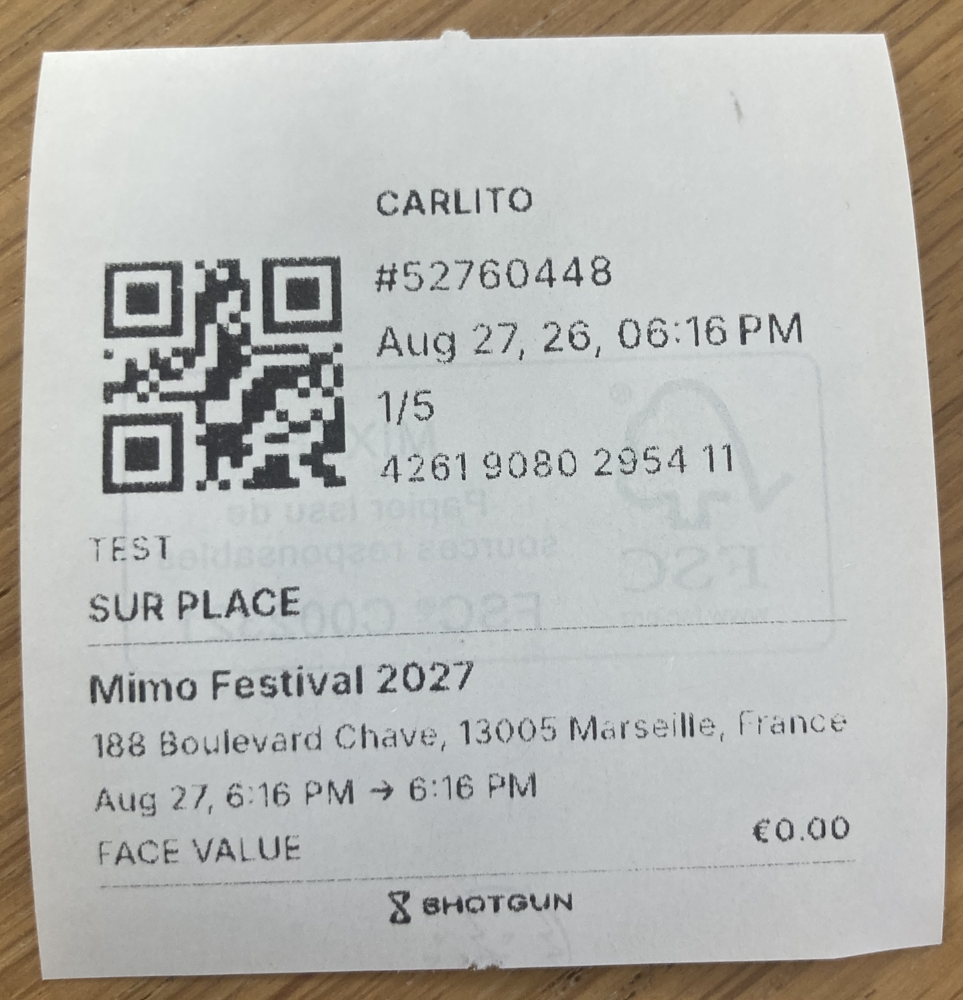
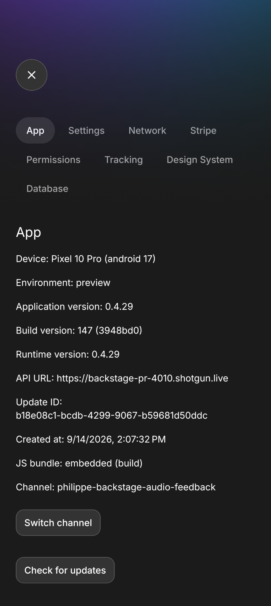

# Surviving D-Day

## Shotgun Backstage: a React Native app for ground operations

Antoine Rousseau — Engineering Manager @ Shotgun

<!--
Speaker Notes:
- ReactCon Berlin. 30 minutes, then 10 for questions.
- Backstage is the app organizers use on D-Day: scan tickets, sell on site, live event data.
- Constraint: a 5-second freeze at the gate puts the queue on the street. Internet is optional.
- We follow one scan through the architecture, not the npm list.
-->

---
layout: two-cols-header
---

# The door cannot stop

::left::

### D-Day

- Basements, fields, packed clubs
- Cellular dies when 10k people arrive
- Staff are stressed and not looking at docs
- A freeze at the gate is a street problem

::right::

### What the architecture must do

- Scan in well under a second, offline
- Keep selling on a normal phone
- Sync nearby devices without a server
- Never crash

<!--
Speaker Notes:
- Paint the room: dark, loud, bouncers with gloves.
- We optimize for "is this person allowed in, right now", not for dashboards.
-->

---
layout: image-right
---

# Fast setup

Create account → Open app → Scan QR → In

::right::

<SlidevVideo autoplay muted loop autoreset="slide">
  <source src="./videos/login.mp4" type="video/mp4" />
</SlidevVideo>

<!--
Speaker Notes:
- Can also log in with username and password
-->

---
layout: image-right
---

# You're in

Press-and-hold → QR → result overlay

<div class="flex gap-4 pt-10">
  <Badge variant="positive">Valid</Badge>
  <Badge variant="warning">Already in</Badge>
  <Badge variant="negative">Invalid</Badge>
</div>

::right::

<SlidevVideo autoplay muted loop autoreset="slide">
  <source src="./videos/scan.mp4" type="video/mp4" />
</SlidevVideo>

<!--
Speaker Notes:
- Play the recording (or live demo). 60-90 seconds max.
- Point out: hold to open the camera, full-screen result, no spinner.
- Then: "that overlay did not wait for our API."
- Tap to Pay has its own demo later. Don't play it here.
-->

---
layout: statement
---

# A scan never waits on the network.

::right::

SQLite is the source of truth at the door.

The server is how we catch up — later.

<!--
Speaker Notes:
- This is the whole talk in one sentence.
- TanStack Query reads from SQLite. It is not caching a REST call made at scan time.
- Ticket not in the local DB yet: still_loading. We never guess.
-->

---

# Shape of the system

Expo app, oRPC server, shared SQLite schema — one TypeScript repo.

```
shotgun/
├── apps/backstage/          # Expo / React Native
├── apps/backstage-server/   # oRPC API (Next.js)
└── packages/backstage/      # Zod, Drizzle, scan types
```

<v-clicks>

- Phone: Expo, [expo-router](https://docs.expo.dev/router/), [Uniwind](https://docs.uniwind.dev/) pro, [expo-sqlite](https://docs.expo.dev/versions/latest/sdk/sqlite/)
- Wire: [oRPC](https://orpc.dev/) + [Zod](https://zod.dev/), typed as `APIClient` from the server
- UUIDs created offline using ATProto's [TIDs](https://atproto.com/specs/tid)

</v-clicks>

<!--
Speaker Notes:
- These three packages are the contract. A schema change in packages/backstage breaks the app and the server at compile time.
- Skip the library list. The pieces show up as we walk the scan.
-->

---

# One QR, end to end

<v-clicks>

1. **Press-and-hold** opens the camera — not always-on (battery, accidents)
2. **SQLite JOIN** loads the ticket, deals, scan logs, transfers
3. **`decideScan()`** returns one of 12 outcomes
4. **Transaction** writes `syncActions` + `scanLogs`
5. **Overlay** immediately — staff already moved on
6. **BLE mesh** broadcasts the scan log to nearby phones
7. **Push** to the server every few seconds, if we have a network

</v-clicks>

<!--
Speaker Notes:
- Spend time here. This is the architecture.
- Serial mutation scope { id: "scan" }: two rapid QR reads don't interleave.
- Mesh and server push are asynchronous. The bouncer doesn't wait.
- Next: camera (1), decideScan (3), write locally (4), then server catch-up (7) and mesh (6).
-->

---
layout: split
---

# The camera is three costs

::right::

Press-and-hold is the first cut. Battery is the rest.

<v-clicks>

- **Native session** — just opening the camera
- **Frame processor** — QR + barcode on every frame
- **The library** — [expo-camera](https://docs.expo.dev/versions/latest/sdk/camera/) is fine so far; we'll measure others if it isn't

</v-clicks>

<!--
Speaker Notes:
- Always-on camera was the battery killer. Press-and-hold also prevents accidental scans (gloves, pockets).
- Even while held open: the native session, the frame processor, the library.
- expo-camera for now. We'd measure alternatives if traces say so. No winner crowned.
-->

---

# `decideScan()` is the product

```typescript
export type ScanDecision =
  | "still_loading" | "unknown"
  | "refunded" | "canceled" | "transferred" | "resold"
  | "wrong_time" | "wrong_access_list" | "several_access_lists"
  | "already_checked_in" | "verification_needed"
  | "checked_in";
```

<!--
Speaker Notes:
- 12 decisions, not a boolean: access lists, time windows, resales, verification warnings.
- still_loading: ticket not in SQLite and the pull is incomplete. Staff wait.
- unknown: pull is complete and the code isn't in it.
- already_checked_in reads local scanLogs, including ones that arrived over mesh.
- Force check-in is a permission, not a default.
-->

---

# Write locally first

```typescript
const syncAction = {
  uuid: generateTID(),
  eventId: payload.eventId,
  payload: scanLog,
  broadcastedAt: null,
  syncedAt: null,
};

await db.transaction(async (tx) => {
  await upsert(client, schema.syncActions, [syncAction], { tx });
  await upsert(client, schema.scanLogs, [scanLog], { tx });
});

// then broadcast over Bluetooth mesh
void sendData({ type: "syncAction", syncAction });
```

The door is done. Sync is an outbox.

<!--
Speaker Notes:
- Outbox: the scan is committed on the device before anyone else knows.
- syncedAt null = not on the server yet. A 5-second interval pushes pending rows.
- broadcastedAt tracks the mesh. A failed broadcast doesn't roll back the scan.
- TIDs: sortable, unique IDs with no server round-trip.
-->

---
layout: section
---

# Catching up

The door is done. Everything after this is bookkeeping.

<!--
Speaker Notes:
- Transition. Breathe.
- Everything so far happened on one phone with no network. Now we reconcile.
-->

---
layout: two-cols-header
---

# Catching up with the server

Events, tickets, deals, scan logs, orders, transfers…

::left::

### Pull — 16 entity streams

- Keyset cursor: `(updatedAt, id)`
- Pages of 2,000
- Full page: again in **1s**. Short page: back to **~10s**

::right::

### Push — the outbox

- `syncActions.push` every **5s**, only if pending
- Server dedupes on UUID
- Bad items dropped; the rest of the batch still applies
- Scan already happened. This is catch-up.

<!--
Speaker Notes:
- Split endpoints, not one sync blob. The old monolithic sync endpoint is only for old clients.
- Full page (2,000) means there's more: poll again in 1s. Short page means we're current: back to steady polling (10s for most streams, slower for rarely-changing ones).
- New phone: no cursor, so the whole event arrives as many full pages.
- Cursor is (updatedAt, id). Skip the details unless asked.
- Push is independent of pull. Offline: sync is paused and rows stay syncedAt null.
- Server handles each action on its own: invalid ones are dropped, known UUIDs are skipped, the rest apply.
-->

---

# Types across the wire

Scan is local. Everything else is a typed oRPC client — not REST, not GraphQL.

```typescript
import type { APIClient } from "backstage-server/client";

export function createAPIClient(headers?: Headers): APIClient {
  const link = new RPCLink({
    url: env.SERVER_URL,
    headers, // Bearer JWT, x-app-version
    interceptors: [onError(/* network | outdated */)],
  });
  return createORPCClient(link);
}
```

Same router type on phone and server. Old binaries get `406` → `/outdated-version`.

<!--
Speaker Notes:
- oRPC: end-to-end TypeScript without maintaining an OpenAPI client.
- GraphQL is only on the server, to list EAS channels from Expo's API.
- x-app-version: we force upgrades rather than debug three app versions in a basement.
-->

---

# Nearby scanners: one scan, two phones

<MeshSyncDiagram />

<!--
Speaker Notes:
Click through:
1. Gate A commits locally: syncActions + scanLogs, syncedAt null. The door is already done.
2. Broadcast via Bridgefy, no internet. Only the sync action goes out, never the DB. On success A stamps broadcastedAt.
3. Gate B looks up the UUID. Known: ignore. Unknown: upsert the scan log and the sync action in one transaction.
4. Payoff: decideScan reads local scanLogs, so the next scan of that ticket at B is already_checked_in. No server.
5. Separate track: every 5s each phone pushes rows with syncedAt null. B has a copy too, so if A never reconnects, B delivers the scan.
6. Server dedupes on UUID: two phones pushing the same action is harmless.
-->

---
layout: two-cols-header
---

# Nearby scanners: the race we still have

It takes **all** of these at the same time:

- The **same valid ticket** at **two different gates**
- Scanned within **the same second**
- Before the Bluetooth message from the first gate reaches the second

Then both scans say `checked_in`, and the server keeps both logs (different UUIDs).

<br />

***Almost impossible in practice**: no need to invent a distributed lock for it.*

::bottom::

Note: for now we use [Bridgefy](https://github.com/bridgefy/bridgefy-react-native), but it can sometimes crash so we will replace it with **[`@shotgun/mesh`](https://github.com/shotgun-warehouse/mesh)** — a simpler BLE mesh library we vibe-coded.

<!--
Speaker Notes:
- Be honest, but keep it in proportion: this is the question you will get, and it needs several things at once.
- Same ticket, two gates, same second, before the mesh message lands. The mesh shrinks that window but doesn't fully close it (range, permissions, no distributed lock).
- Say this sentence: we accept a tiny double-scan window over blocking the door.
- Why own the mesh: Bridgefy crashes in the field. @shotgun/mesh is GATT writes + TTL gossip for small meshes, inspired by BitChat.
- Android needs Bluetooth + location permissions. The simulator is a no-op.
-->

---
layout: section
glow: top-left
---

# The rest of the kit

Selling, printing, permissions, and keeping it all observable.

<!--
Speaker Notes:
- Transition. The scan path is done. This is everything else door staff touch.
- Running long? Start cutting here.
-->

---
layout: image-right
fit: contain
---

# Tap to Pay

Phone → tap → paid → share ticket

`stripe-terminal-react-native`

::right::

<SlidevVideo autoplay muted loop autoreset="slide">
  <source src="./videos/taptopay.mp4" type="video/mp4" />
</SlidevVideo>

<!--
Speaker Notes:
- Same beat as the scan: the phone is the terminal. No POS hardware.
- Stripe Terminal handles payment. Cash, card and Pix are permission-gated.
- Our native Expo module (IosTapToPay) only shows Apple's "how to tap" sheet. Stripe does the rest.
- Session expiry mid-event: reconnect and retry. Don't dwell unless asked.
-->

---
layout: image-right
fit: contain
---

# Thermal tickets

Star Micronics — Bluetooth or USB

### What we print

The ticket they just bought, QR and all. It prints by itself after the sale, and
a cash sale opens the drawer.

<br />

### How

**Skia** draws the ticket → bitmap → printer. A local queue handles retries and
uncertain outcomes. The sale is done; the print is catch-up.

::right::



<!--
Speaker Notes:
- Skia so the ticket layout is ours, not ESC/POS templates.
- The queue lives on the device: same offline-first instinct as scans.
- Pairing and test print are in settings. After a sale a print is enqueued; cash sales can open the drawer.
- The Star printer is the only extra hardware at the till.
-->

---
layout: two-cols-header
---

# Who can do what

Roles are a default. Events override.

::left::

### Permissions, not just admin/editor

- `scan` / `force_check_in`
- `sell_taptopay` / `sell_cash` / `sell_pix`
- `refund_all` / `refund_onsite`
- `display_scan_module` / `display_pos_module`

::right::

### Enforced twice

- Server: `permissionMiddleware` on oRPC
- Client: hide the module, still fail closed on the API
- Cached locally in `eventPermissions` for offline UI

<!--
Speaker Notes:
- A bartender sells cash but doesn't refund last night's online sales.
- A door person scans, but can't force check-in.
- Per-event overrides live in eventMemberPermissionOverrides.
- Offline, the UI uses the last synced permissions. The server checks again on every call.
-->

---
layout: image-right
fit: contain
---

# Channel surfing

QA on a physical phone, no native rebuild.

```typescript
setUpdateRequestHeadersOverride({
  "expo-channel-name": channel,
});

if ((await checkForUpdateAsync()).isAvailable) {
  await fetchUpdateAsync();
}
await reloadAsync();
```

Every PR publishes an EAS Update. Preview builds let you pick the channel in a
debug screen.

::right::



<!--
Speaker Notes:
- Runtime version follows appVersion: JS-only PRs go OTA, native changes need a new binary.
- Preview only. Production staff never see this menu.
- That's how we test scan + Tap to Pay on real hardware the week of the event, without a TestFlight per PR.
- Short on time? Skip this one. The scan path is not skippable.
-->

---
layout: two-cols-header
---

# How we test

Vitest for the API. Maestro for the app.

::left::

### API — Vitest

Call the oRPC procedure. Real DB. Isolated per test.

```typescript
await call(syncActions.push, { syncActions }, { context })
```

UUID dedupe, permissions, refunds — same routers the phone hits.

::right::

### App — Maestro

YAML on a real iOS build. Seeded event, then teardown.

```yaml
- tapOn: { id: module_sell }
- tapOn: { id: cash }
- assertVisible: { id: sale_registered }
```

Login, ticketing, sell. Not the camera. Yet.

<!--
Speaker Notes:
- API: Vitest + call() from @orpc/server. Same procedures the app hits. Real Postgres, each test in a savepoint that's rolled back.
- syncActions.push is the key test: UUID is idempotent, a bad item doesn't fail the batch, a succeeded scan sets redeemedAt.
- decideScan / evaluateScan: Vitest on the client (~850 lines of tests), no DB. Don't mix it into the API column unless asked.
- Maestro: login, seeded event, create a ticket, cash sale, logout. testIDs, not screenshots.
- CI: EAS workflow on main: seed an event, iOS e2e build, Maestro (2 retries), teardown.
- Camera scan isn't in Maestro (press-and-hold, lighting, hardware). Channel surfing is how we QA that.
- Skipped channel surfing? Skip this too.
-->

---
layout: two-cols-header
---

# Sentry

A freeze or a crash is a problem. A network error is not.

::left::

### Ignore the noise

```typescript
Sentry.init({
  ignoreErrors: [NETWORK_ERROR_MESSAGE_REGEX],
  tracesSampleRate: 1,
  enableLogs: true,
})
```

*Traces and logs run in production too.*

::right::

### Keep the door up

- Error boundary: toast, then retry
- Tag `git_hash` — which OTA
- Tag `context` + `action` — Scan, Mesh, Stripe

<!--
Speaker Notes:
- ignoreErrors: cellular dying is the product constraint. Don't page on "fetch failed".
- GlobalErrorWatcher: network errors are swallowed; anything else toasts and goes to Sentry. In prod we don't call the default handler: it would take down the JS runtime at the door.
- Traces (100%) and logs are on in production too, since late September.
- git_hash = EXPO_PUBLIC_GIT_HASH: you know which build is on the phone.
- reportError(context, action) is how Stripe, mesh and scan errors get their tags.
- Sentry.wrap(RootLayout) + wrapExpoRouterErrorBoundary: retry, not a white screen.
- Short on time? Skip with the testing slide.
-->

---
layout: cards
---

# Takeaways

::cards::

<Card label="Treat the network as optional">

Scan against SQLite. Sync is an outbox.

</Card>

<Card label="Name the race">

Mesh shrinks double-scans. It does not give you a lock.

</Card>

<Card label="Share types, not URLs">

Monorepo + oRPC + Zod.

</Card>

<!--
Speaker Notes:
- Leave this up and walk the three cards slowly.
- Invite questions: the double-scan window, mesh vs Bridgefy, camera battery, printing, Expo modules, permissions, testing, Sentry.
-->

---
layout: end
---

# Thank you

## Questions

Antoine Rousseau — Engineering Manager @ Shotgun

::right::


<!--
Speaker Notes:
- 10 minutes of Q&A. Likely questions:
  - Double-scan: UUID idempotency + local scanLogs. The window exists before mesh/server. We chose door speed.
  - Battery: press-and-hold first, then the camera session, frame processor and library (expo-camera today).
  - Mesh: Bridgefy crashed in the field. In-house @shotgun/mesh: GATT gossip, small meshes, we own the crashes.
  - Conflict UI: none. Staff see already_checked_in from local logs.
  - Printing: Star thermal printers, Skia-rendered tickets, local queue. On-site tickets, not PDF-only.
  - Testing: Vitest on decideScan and oRPC; Maestro covers login/sell/ticketing, not camera scan (yet).
-->
